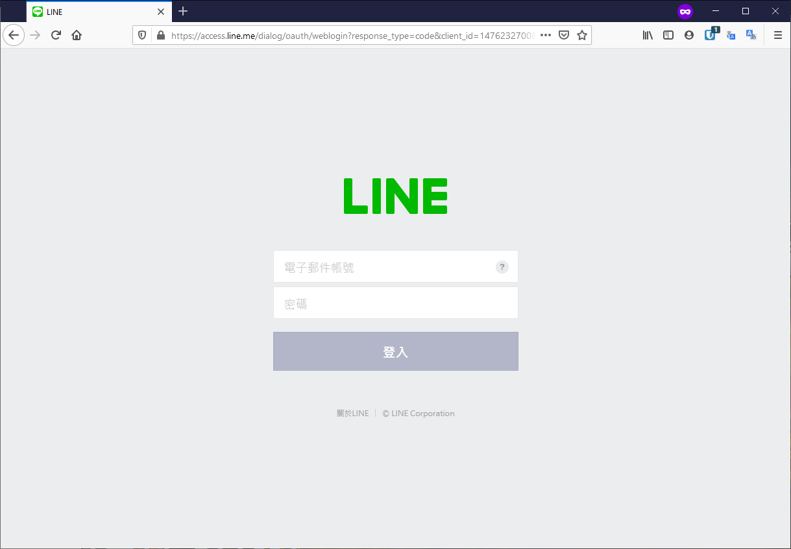
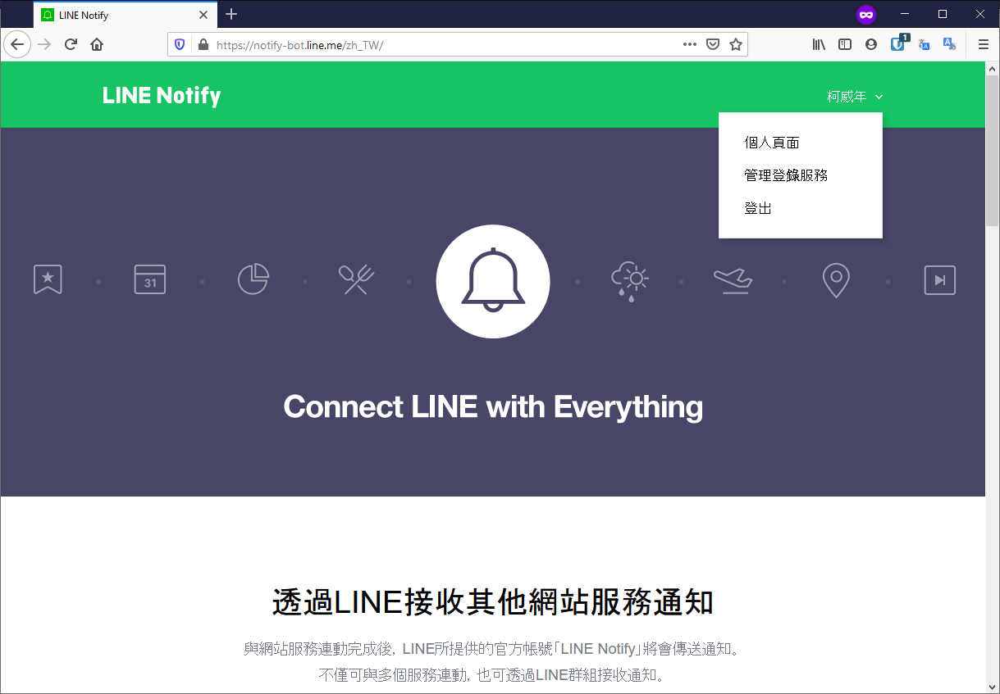
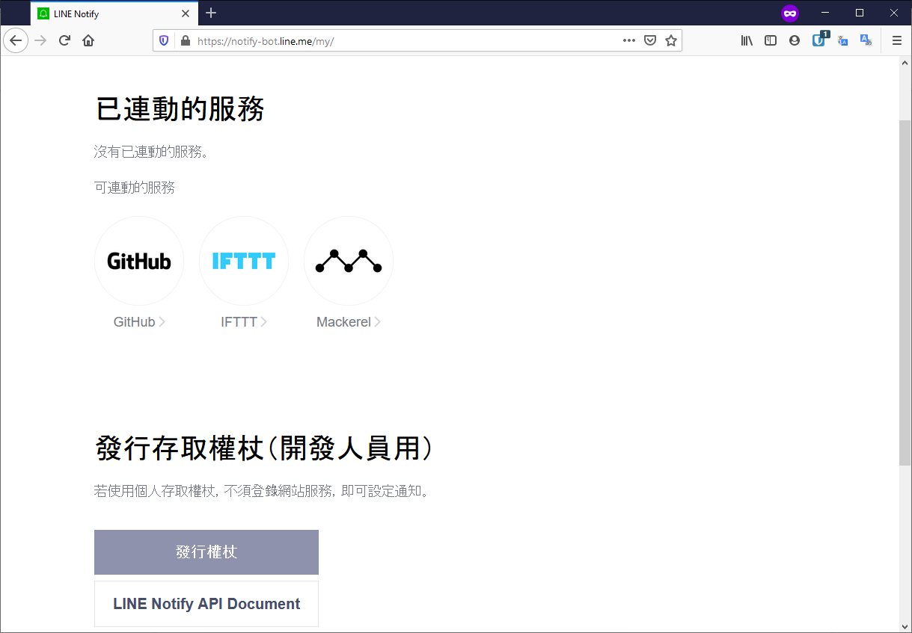
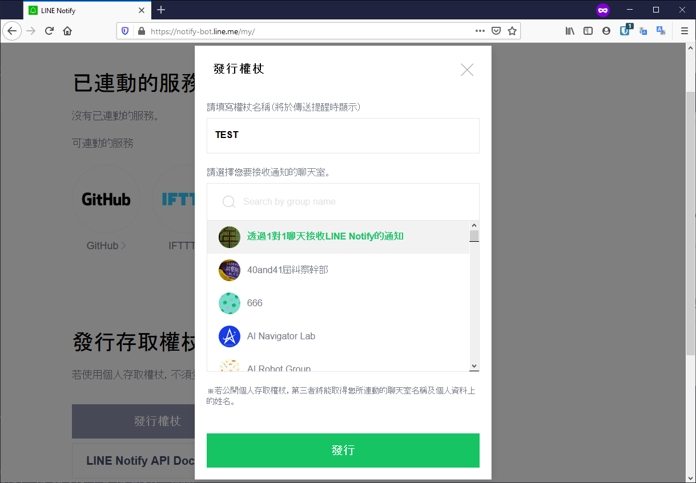
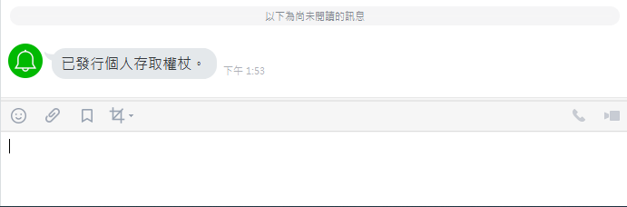

# Line Notify 教學
## 大綱
* [1. Line Notify 介紹](#1.-Line-Notify-介紹)
* [2. 申請 Token](#2.-申請-Token)
* [3. 程式撰寫](#3.-程式撰寫)

## 1. Line Notify 介紹
> Line Notify官方介紹： https://notify-bot.line.me/zh_TW/  
> Line Notify API Document: https://notify-bot.line.me/doc/en/

簡單來說，Line Notify是由Line官方提供的訊息推播服務，可以單方面的傳送訊息給使用者。雖然不能與使用者對話，但是Notify功能是免費的。

## 2. 申請 Token
   1. 從上方[Line Notify](https://notify-bot.line.me/zh_TW/)的網頁右上角登入你的 Line 帳號。  
   

   2. 登入後從畫面右上角，選擇**個人頁面**。
   

   3. 選擇下方的**發行權杖**。  
   

   4. 設定好名稱及選擇**透過1對1聊天接收Line Notify的通知**，完成後點擊**發行**。
   

   5. 這時畫面會出現一組 Token 以及 Line 會跳出通知。  
      **注意！！在關掉 Token 畫面前，務必要先複制好 Token 並保存好，Token只會出現一次，若是弄了，只能在重複以上3、4步驟重新申請一組 Token**  
   

   6. Token 申請好後，便可以參照[Line Notify API Document](https://notify-bot.line.me/doc/en/)，開始開發程式。

## 3. 程式撰寫
> 程式碼請參考demo.py